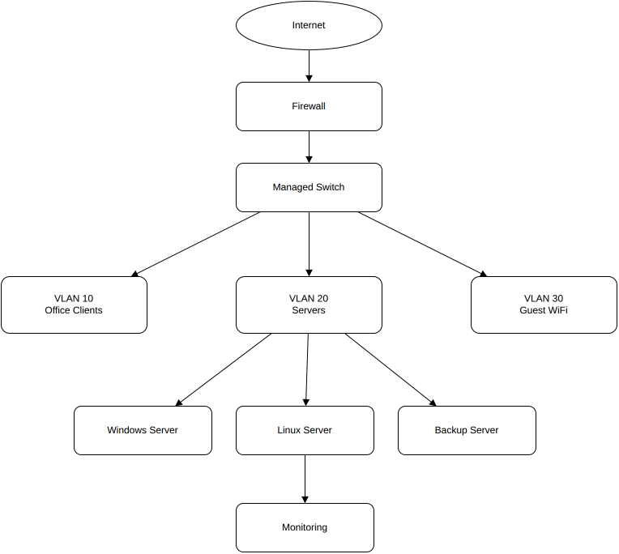

# NIS2 Infrastructure Documentation Kit

Professional infrastructure documentation, network architecture and security baseline framework for modern IT environments.

---

## Focus Areas

- IT Infrastructure Documentation
- Network Architecture
- Linux & Windows Administration
- Security Hardening
- Backup & Disaster Recovery
- VLAN Segmentation
- Technical Documentation
- NIS2 Readiness

---

## Repository Structure

| Directory | Purpose |
|---|---|
| `network/` | Network architecture and VLAN concepts |
| `security/` | Security baseline and hardening |
| `backup/` | Backup and disaster recovery concepts |
| `diagrams/` | Infrastructure and topology diagrams |
| `templates/` | Technical assessment templates |
| `scripts/` | Infrastructure automation scripts |

---

## Infrastructure Diagram

---

## Technologies

- Linux
- Windows Server
- Docker
- Proxmox
- Networking
- Bash
- PowerShell
- Python
- Microsoft 365
- Azure / Entra ID

---

## Goal

This repository demonstrates structured infrastructure analysis,
technical documentation methodologies and security-oriented IT architecture.
